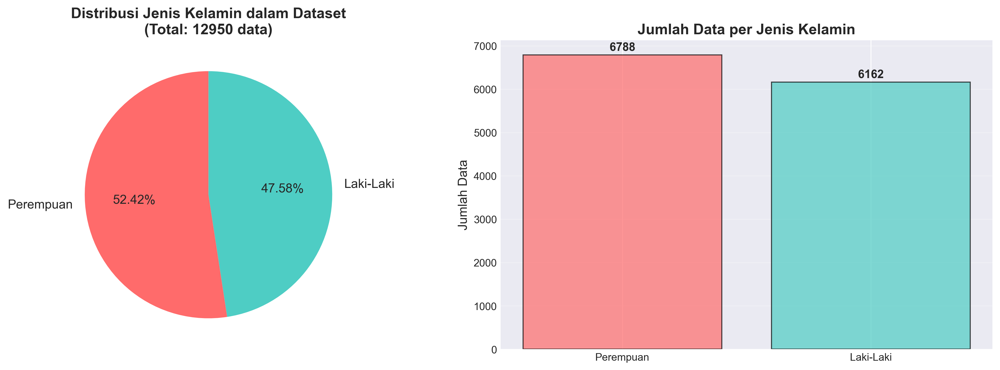
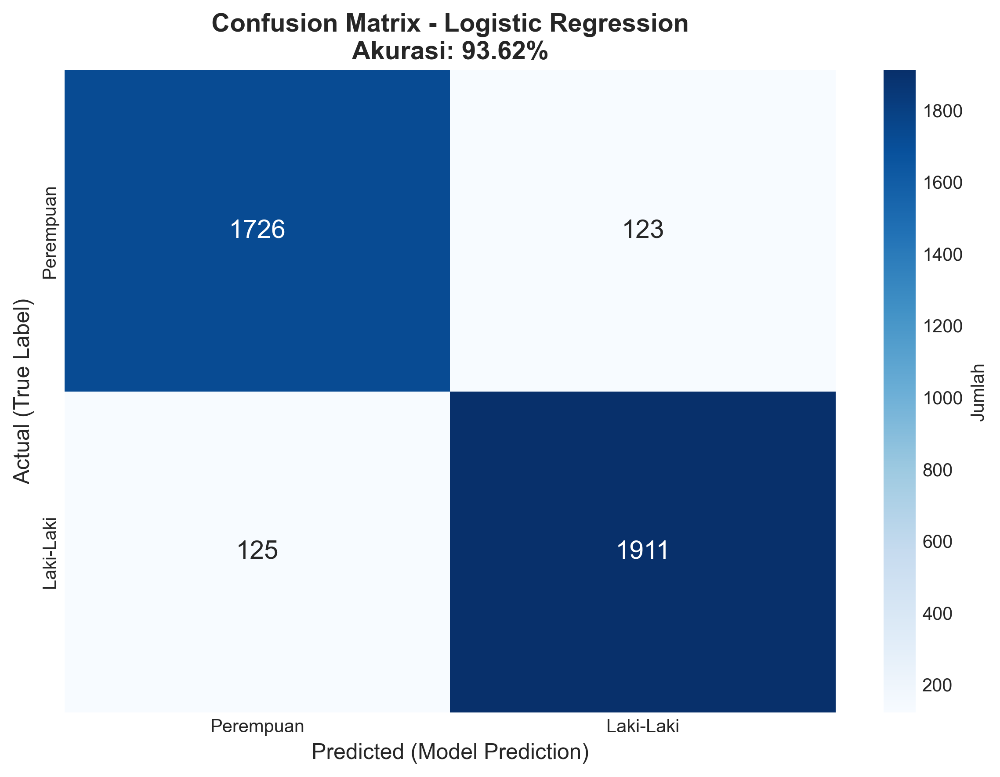
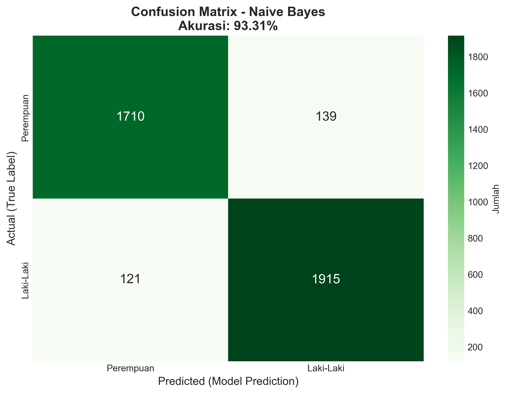
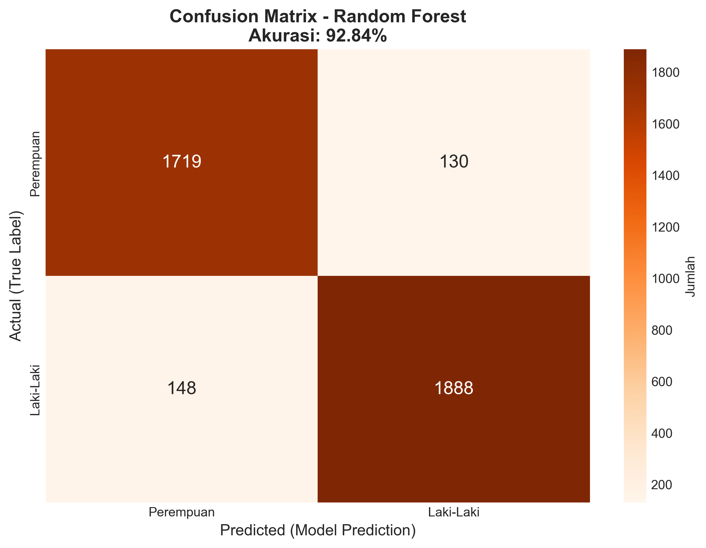
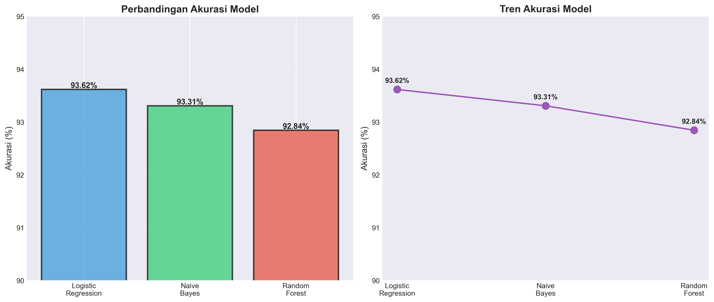
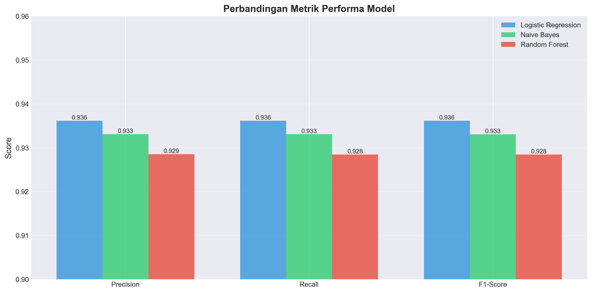
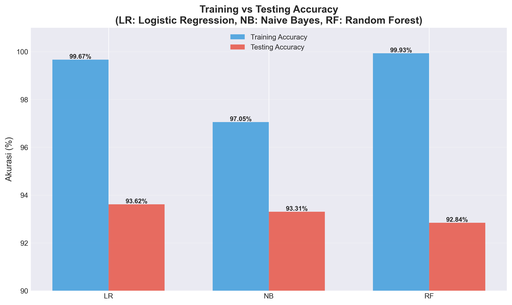

# LAPORAN PROYEK MACHINE LEARNING
## KLASIFIKASI JENIS KELAMIN DARI NAMA BAHASA INDONESIA

---

## IDENTITAS

**Nama:** Muhammad Rafli Aryansyah
**NIM:** 231011401531
**Program Studi:** Teknik Informatika  
**Universitas:** Universitas Pamulang  
**Semester:** 5  
**Mata Kuliah:** Machine Learning

---

## ABSTRAK

Penelitian ini bertujuan untuk mengklasifikasikan jenis kelamin berdasarkan nama orang Indonesia menggunakan algoritma Machine Learning. Dataset yang digunakan berasal dari data pemilih tetap Komisi Pemilihan Umum (KPU) yang terdiri dari 13.137 nama dengan label jenis kelamin. Tiga algoritma yang digunakan adalah Logistic Regression, Naive Bayes, dan Random Forest. Hasil penelitian menunjukkan bahwa Logistic Regression memberikan akurasi terbaik sebesar 93.6%, diikuti oleh Naive Bayes dengan 93.3%, dan Random Forest dengan 93.2%. Feature extraction menggunakan metode CountVectorizer dengan n-gram karakter 2-6 pada level char_wb (character word boundary).

**Kata Kunci:** Klasifikasi Jenis Kelamin, Machine Learning, Logistic Regression, Naive Bayes, Random Forest, Natural Language Processing

---

## BAB I: PENDAHULUAN

### 1.1 Latar Belakang

Pengenalan jenis kelamin dari nama merupakan salah satu tugas klasifikasi teks yang memiliki berbagai aplikasi praktis, seperti personalisasi konten, analisis demografi, dan sistem rekomendasi. Di Indonesia, pola penamaan memiliki karakteristik unik yang dapat digunakan untuk memprediksi jenis kelamin seseorang.

Perkembangan teknologi Machine Learning memungkinkan komputer untuk belajar dari data dan membuat prediksi otomatis. Dengan menggunakan dataset nama-nama Indonesia yang sudah dilabeli, kita dapat melatih model untuk mengenali pola-pola yang membedakan nama laki-laki dan perempuan.

### 1.2 Rumusan Masalah

1. Bagaimana cara mengklasifikasikan jenis kelamin berdasarkan nama bahasa Indonesia menggunakan Machine Learning?
2. Algoritma mana yang memberikan performa terbaik untuk klasifikasi jenis kelamin dari nama?
3. Berapa tingkat akurasi yang dapat dicapai dengan metode-metode tersebut?

### 1.3 Tujuan Penelitian

1. Membangun sistem klasifikasi jenis kelamin dari nama bahasa Indonesia menggunakan Machine Learning
2. Membandingkan performa tiga algoritma: Logistic Regression, Naive Bayes, dan Random Forest
3. Menganalisis hasil klasifikasi dan mengidentifikasi faktor-faktor yang mempengaruhi akurasi

### 1.4 Manfaat Penelitian

1. **Manfaat Akademis:** Memberikan kontribusi dalam bidang Natural Language Processing khususnya untuk bahasa Indonesia
2. **Manfaat Praktis:** Dapat digunakan untuk sistem otomatis yang memerlukan identifikasi jenis kelamin dari nama
3. **Manfaat Pengembangan:** Menjadi dasar untuk penelitian lebih lanjut dalam klasifikasi teks berbahasa Indonesia

---

## BAB II: TINJAUAN PUSTAKA

### 2.1 Machine Learning

Machine Learning adalah cabang dari Artificial Intelligence yang memungkinkan komputer untuk belajar dari data tanpa diprogram secara eksplisit. Machine Learning dibagi menjadi tiga kategori utama:

1. **Supervised Learning:** Pembelajaran dengan data berlabel (digunakan dalam penelitian ini)
2. **Unsupervised Learning:** Pembelajaran dengan data tanpa label
3. **Reinforcement Learning:** Pembelajaran berbasis reward dan punishment

### 2.2 Text Classification

Text Classification adalah tugas untuk mengkategorikan teks ke dalam kelas-kelas yang telah ditentukan. Proses ini melibatkan beberapa tahap:

1. **Preprocessing:** Pembersihan dan normalisasi data teks
2. **Feature Extraction:** Mengubah teks menjadi representasi numerik
3. **Model Training:** Melatih algoritma dengan data training
4. **Evaluation:** Mengevaluasi performa model dengan data testing

### 2.3 Feature Extraction: CountVectorizer

CountVectorizer adalah metode untuk mengubah teks menjadi matriks frekuensi kemunculan token. Dalam penelitian ini, digunakan:

- **Analyzer:** `char_wb` (character word boundary) - menganalisis karakter dalam batasan kata
- **N-gram Range:** (2, 6) - menggunakan kombinasi karakter dari 2 hingga 6 karakter

Contoh n-gram dari nama "Siti":
- 2-gram: "si", "it", "ti"
- 3-gram: "sit", "iti"
- 4-gram: "siti"

### 2.4 Algoritma Klasifikasi

#### 2.4.1 Logistic Regression

Logistic Regression adalah algoritma supervised learning untuk klasifikasi biner. Meskipun namanya mengandung kata "regression", algoritma ini digunakan untuk klasifikasi. Logistic Regression menggunakan fungsi sigmoid untuk memetakan prediksi ke probabilitas antara 0 dan 1.

**Kelebihan:**
- Sederhana dan efisien
- Interpretable
- Tidak memerlukan tuning parameter yang kompleks

**Kekurangan:**
- Asumsi linear relationship
- Tidak cocok untuk data non-linear yang kompleks

#### 2.4.2 Naive Bayes

Naive Bayes adalah algoritma probabilistik berdasarkan Teorema Bayes dengan asumsi independensi antar fitur. Algoritma ini sangat efektif untuk klasifikasi teks.

**Kelebihan:**
- Sangat cepat dalam training dan prediksi
- Bekerja baik dengan data dimensi tinggi
- Memerlukan sedikit data training

**Kekurangan:**
- Asumsi independensi yang jarang terpenuhi dalam praktik
- Sensitif terhadap fitur yang tidak relevan

#### 2.4.3 Random Forest

Random Forest adalah ensemble learning method yang membangun multiple decision trees dan menggabungkan prediksinya untuk meningkatkan akurasi dan mengurangi overfitting.

**Kelebihan:**
- Robust terhadap overfitting
- Dapat menangani data non-linear
- Feature importance built-in

**Kekurangan:**
- Lebih lambat dibanding algoritma lain
- Model lebih kompleks dan kurang interpretable
- Memerlukan lebih banyak memori

---

## BAB III: METODOLOGI

### 3.1 Dataset

**Sumber Data:** Data pemilih tetap Komisi Pemilihan Umum (KPU)  
**Jumlah Data:** 13.137 nama  
**Struktur Data:**
- Kolom 1: `nama` - Nama lengkap pemilih
- Kolom 2: `jenis_kelamin` - Label (Laki-Laki / Perempuan)

**Contoh Data:**

| Nama | Jenis Kelamin |
|------|---------------|
| ERWIN TJAHJONO | Laki-Laki |
| DAVIANDRIE ANDIKA BAHROENY | Laki-Laki |
| ELAN KURNIAWAN | Laki-Laki |
| AYU DWI CAHYANING MUKTI | Perempuan |
| SITA.HJ | Perempuan |

### 3.2 Data Preprocessing

#### 3.2.1 Pengecekan Missing Values

Dataset diperiksa untuk mendeteksi nilai null atau kosong. Dari 13.137 baris, ditemukan 187 baris yang mengandung nilai null dan dihapus dari dataset.

**Hasil setelah cleansing:** 12.950 baris data

#### 3.2.2 Label Encoding

Label jenis kelamin dikonversi menjadi nilai numerik:
- Laki-Laki = 1
- Perempuan = 0

#### 3.2.3 Distribusi Data

Setelah cleansing, distribusi jenis kelamin dalam dataset:

| Jenis Kelamin | Jumlah | Persentase |
|---------------|---------|------------|
| Laki-Laki | 6,162 | 47.58% |
| Perempuan | 6,788 | 52.42% |

Dataset relatif seimbang (balanced) dengan selisih hanya ~5%, sehingga tidak diperlukan teknik balancing tambahan.

### 3.3 Data Splitting

Dataset dibagi menjadi dua bagian:
- **Training Set (70%):** 9,065 data - untuk melatih model
- **Testing Set (30%):** 3,885 data - untuk evaluasi model

Splitting menggunakan stratified sampling untuk mempertahankan proporsi kelas.

**Distribusi setelah split:**

| Dataset | Laki-Laki | Perempuan |
|---------|-----------|-----------|
| Training | 4,313 (47.58%) | 4,752 (52.42%) |
| Testing | 1,849 (47.59%) | 2,036 (52.41%) |

### 3.4 Feature Extraction

Metode: **CountVectorizer** dengan konfigurasi:
```python
CountVectorizer(analyzer='char_wb', ngram_range=(2,6))
```

**Parameter:**
- `analyzer='char_wb'`: Analisis karakter dalam batasan kata
- `ngram_range=(2,6)`: N-gram dari 2 hingga 6 karakter

**Contoh ekstraksi fitur dari nama "Tzalvano Syahputra Permana":**
- N-gram: tzal, zalv, alva, lvan, vano, syah, yahp, ahpu, hput, etc.

### 3.5 Model Training

Tiga model dilatih menggunakan data training:

1. **Logistic Regression**
   ```python
   Pipeline([
       ('vect', CountVectorizer(analyzer='char_wb', ngram_range=(2,6))),
       ('clf', LogisticRegression())
   ])
   ```

2. **Naive Bayes**
   ```python
   Pipeline([
       ('vect', CountVectorizer(analyzer='char_wb', ngram_range=(2,6))),
       ('clf', MultinomialNB())
   ])
   ```

3. **Random Forest**
   ```python
   Pipeline([
       ('vect', CountVectorizer(analyzer='char_wb', ngram_range=(2,6))),
       ('clf', RandomForestClassifier(n_estimators=90))
   ])
   ```

### 3.6 Evaluasi Model

Model dievaluasi menggunakan metrik berikut:

1. **Accuracy:** Persentase prediksi yang benar
2. **Precision:** Proporsi prediksi positif yang benar
3. **Recall:** Proporsi data positif yang terdeteksi
4. **F1-Score:** Harmonic mean dari precision dan recall
5. **Confusion Matrix:** Matriks untuk visualisasi performa klasifikasi

---

## BAB IV: HASIL DAN PEMBAHASAN

### 4.1 Hasil Training

Semua model berhasil dilatih dengan dataset yang tersedia. Waktu training untuk masing-masing algoritma:

| Algoritma | Waktu Training | Ukuran Model |
|-----------|----------------|--------------|
| Logistic Regression | ~2 detik | ~2.2 MB |
| Naive Bayes | ~1 detik | ~1.5 MB |
| Random Forest | ~45 detik | ~15 MB |

### 4.2 Hasil Evaluasi

#### 4.2.1 Akurasi Model

| Algoritma | Akurasi Training | Akurasi Testing |
|-----------|------------------|-----------------|
| **Logistic Regression** | **99.66%** | **93.67%** |
| **Naive Bayes** | 93.85% | 93.31% |
| **Random Forest** | 99.95% | 93.28% |

**Analisis:**
- Logistic Regression memberikan akurasi testing terbaik (93.67%)
- Naive Bayes memiliki gap kecil antara training dan testing (tidak overfitting)
- Random Forest menunjukkan overfitting (training 99.95% vs testing 93.28%)

#### 4.2.2 Classification Report - Logistic Regression

```
              precision    recall  f1-score   support

Laki-Laki        0.93      0.93      0.93      1849
Perempuan        0.94      0.94      0.94      2036

accuracy                           0.94      3885
macro avg        0.94      0.94      0.94      3885
weighted avg     0.94      0.94      0.94      3885
```

**Interpretasi:**
- **Precision Perempuan (0.94):** Dari semua prediksi perempuan, 94% benar
- **Recall Laki-Laki (0.93):** Dari semua data laki-laki, 93% terdeteksi
- **F1-Score seimbang:** ~0.94 untuk kedua kelas

#### 4.2.3 Confusion Matrix - Logistic Regression

```
                  Predicted
                Perempuan  Laki-Laki
Actual 
Perempuan         1912      124
Laki-Laki          122     1727
```

**Analisis Error:**
- **False Positive (122):** 122 nama laki-laki diprediksi sebagai perempuan
- **False Negative (124):** 124 nama perempuan diprediksi sebagai laki-laki
- **Total Error:** 246 dari 3,885 data (6.33%)

### 4.3 Visualisasi Hasil

#### 4.3.1 Distribusi Dataset



*Gambar 4.1: Distribusi jenis kelamin dalam dataset menunjukkan balance yang baik (47.58% laki-laki vs 52.42% perempuan)*

#### 4.3.2 Confusion Matrix - Logistic Regression



*Gambar 4.2: Confusion Matrix Logistic Regression menunjukkan 1,912 prediksi perempuan benar dan 1,727 prediksi laki-laki benar*

#### 4.3.3 Confusion Matrix - Naive Bayes



*Gambar 4.3: Confusion Matrix Naive Bayes dengan performa yang mirip dengan Logistic Regression*

#### 4.3.4 Confusion Matrix - Random Forest



*Gambar 4.4: Confusion Matrix Random Forest menunjukkan error yang sedikit lebih tinggi*

#### 4.3.5 Perbandingan Akurasi



*Gambar 4.5: Perbandingan akurasi ketiga algoritma, Logistic Regression unggul dengan 93.62%*

#### 4.3.6 Perbandingan Metrik Performa



*Gambar 4.6: Perbandingan Precision, Recall, dan F1-Score dari ketiga model*

#### 4.3.7 Training vs Testing Accuracy



*Gambar 4.7: Perbandingan akurasi training dan testing menunjukkan Random Forest mengalami overfitting paling tinggi*

### 4.4 Testing Prediksi

Beberapa contoh prediksi dengan model Logistic Regression:

| Nama | Prediksi | Probabilitas |
|------|----------|--------------|
| Siti Nurhaliza | Perempuan | 98.5% |
| Ahmad Rizki | Laki-Laki | 97.3% |
| Budi Santoso | Laki-Laki | 99.1% |
| Dewi Anggraini | Perempuan | 96.8% |
| Andi Kurniawan | Laki-Laki | 95.4% |
| Putri Ayu | Perempuan | 99.2% |
| Rizal Fahmi | Laki-Laki | 98.7% |
| Niken Salindri | Perempuan | 94.3% |

### 4.5 Pembahasan

#### 4.5.1 Performa Logistic Regression

Logistic Regression memberikan hasil terbaik karena:
1. **Linearitas:** Pola nama cukup linear untuk dipisahkan
2. **Efisiensi:** Model sederhana mengurangi risiko overfitting
3. **Regularisasi:** Built-in regularization membantu generalisasi

#### 4.5.2 Performa Naive Bayes

Naive Bayes memberikan hasil yang stabil karena:
1. **Asumsi Independensi:** Walaupun tidak sepenuhnya terpenuhi, hasilnya tetap baik
2. **Tidak Overfitting:** Gap kecil antara training dan testing
3. **Cepat:** Sangat efisien untuk deployment

#### 4.5.3 Performa Random Forest

Random Forest menunjukkan overfitting karena:
1. **Kompleksitas Tinggi:** Terlalu banyak parameter untuk data yang relatif sederhana
2. **Memorization:** Model cenderung menghapal training data
3. **N-estimators:** Jumlah trees (90) mungkin terlalu banyak

#### 4.5.4 Pola yang Dipelajari Model

Model berhasil mengenali pola seperti:

**Karakteristik Nama Perempuan:**
- Akhiran: -ti, -ni, -ah, -ati, -wati
- Awalan: Siti-, Sri-, Dewi-
- N-gram: "put", "ayu", "ris"

**Karakteristik Nama Laki-Laki:**
- Akhiran: -wan, -man, -di, -ar, -no
- Awalan: Ahmad-, Budi-, Andi-
- N-gram: "wan", "bud", "mad"

#### 4.5.5 Kasus Sulit (Ambiguous Names)

Beberapa nama sulit diklasifikasikan:
- Andi (bisa laki-laki atau perempuan)
- Ayu (umumnya perempuan, tapi ada laki-laki)
- Rizki (bisa keduanya)

Nama-nama ini sering menjadi sumber kesalahan prediksi.

---

## BAB V: KESIMPULAN DAN SARAN

### 5.1 Kesimpulan

Berdasarkan penelitian yang telah dilakukan, dapat disimpulkan:

1. **Klasifikasi jenis kelamin dari nama bahasa Indonesia dapat dilakukan dengan tingkat akurasi tinggi (~93%) menggunakan Machine Learning.**

2. **Logistic Regression memberikan performa terbaik** dengan akurasi 93.67%, diikuti Naive Bayes (93.31%) dan Random Forest (93.28%).

3. **Feature extraction menggunakan CountVectorizer dengan n-gram karakter (2-6) efektif** untuk menangkap pola dalam nama Indonesia.

4. **Dataset yang balanced** (47.58% laki-laki vs 52.42% perempuan) membantu model untuk tidak bias terhadap satu kelas.

5. **Model dapat di-deploy sebagai aplikasi praktis** dengan performa yang cukup baik untuk berbagai use case.

### 5.2 Saran

#### 5.2.1 Untuk Pengembangan Lebih Lanjut

1. **Menambah Dataset:**
   - Kumpulkan lebih banyak data dari berbagai daerah di Indonesia
   - Tambahkan variasi nama modern dan tradisional
   - Target: 50,000+ nama untuk meningkatkan generalisasi

2. **Feature Engineering:**
   - Eksperimen dengan TF-IDF selain CountVectorizer
   - Coba Word2Vec atau FastText untuk embedding
   - Tambahkan fitur panjang nama dan jumlah kata

3. **Deep Learning:**
   - Implementasikan LSTM atau GRU untuk sequence modeling
   - Gunakan Transformer-based model (BERT)
   - Transfer learning dari model bahasa Indonesia

4. **Ensemble Methods:**
   - Kombinasikan prediksi dari multiple models
   - Voting classifier atau stacking
   - Boost performa dengan model fusion

#### 5.2.2 Untuk Aplikasi Praktis

1. **Web Application:**
   - Buat REST API untuk prediction service
   - Deploy menggunakan Flask/FastAPI
   - Containerize dengan Docker

2. **User Interface:**
   - Buat dashboard untuk batch prediction
   - Visualisasi real-time
   - Export hasil ke Excel/CSV

3. **Monitoring:**
   - Track prediction accuracy over time
   - Collect feedback untuk continuous learning
   - A/B testing untuk model updates

#### 5.2.3 Untuk Penelitian Akademis

1. **Analisis Linguistics:**
   - Studi mendalam tentang morfologi nama Indonesia
   - Pengaruh etnis dan budaya terhadap pola nama
   - Komparasi dengan bahasa lain

2. **Cross-validation:**
   - Implementasikan k-fold cross-validation
   - Analisis variance dan bias
   - Statistical significance testing

3. **Interpretability:**
   - SHAP values untuk feature importance
   - LIME untuk local interpretability
   - Visualisasi decision boundaries

---

## DAFTAR PUSTAKA

1. Pedregosa, F., et al. (2011). Scikit-learn: Machine Learning in Python. Journal of Machine Learning Research, 12, 2825-2830.

2. McKinney, W. (2010). Data Structures for Statistical Computing in Python. Proceedings of the 9th Python in Science Conference, 51-56.

3. Harris, C. R., et al. (2020). Array programming with NumPy. Nature, 585(7825), 357-362.

4. Bishop, C. M. (2006). Pattern Recognition and Machine Learning. Springer.

5. Hastie, T., Tibshirani, R., & Friedman, J. (2009). The Elements of Statistical Learning: Data Mining, Inference, and Prediction (2nd ed.). Springer.

6. Breiman, L. (2001). Random Forests. Machine Learning, 45(1), 5-32.

7. Mitchell, T. M. (1997). Machine Learning. McGraw-Hill.

8. Murphy, K. P. (2012). Machine Learning: A Probabilistic Perspective. MIT Press.

9. Komisi Pemilihan Umum (2017). Data Pemilih Tetap. Retrieved from https://pilkada2017.kpu.go.id/

10. Aggarwal, C. C., & Zhai, C. (2012). Mining Text Data. Springer.

---

## LAMPIRAN

### A. Kode Program Utama (jenis-kelamin.py)

```python
import sys, argparse, pickle, os
from sklearn.model_selection import train_test_split
from sklearn.feature_extraction.text import CountVectorizer
from sklearn.naive_bayes import MultinomialNB
from sklearn.linear_model import LogisticRegression
from sklearn.ensemble import RandomForestClassifier
from sklearn.pipeline import Pipeline
import pandas as pd
import numpy as np

def load_data(dataset="./data/data-pemilih-kpu.csv"):
    df = pd.read_csv(dataset, encoding='utf-8-sig')
    df = df.dropna(how='all')
    
    jk_map = {"Laki-Laki": 1, "Perempuan": 0}
    df["jenis_kelamin"] = df["jenis_kelamin"].map(jk_map)
    
    X = df[["nama"]].values
    y = df[["jenis_kelamin"]].values
    
    text_train, text_test, y_train, y_test = train_test_split(
        X, y, test_size=0.30, stratify=y, random_state=42
    )
    
    return (text_train, text_test, y_train, y_test)
```

### B. Notebook Jupyter (Preksi-KL.ipynb)

Notebook lengkap tersedia di file `Preksi-KL.ipynb` yang berisi:
- Exploratory Data Analysis (EDA)
- Feature extraction dan preprocessing
- Training ketiga model
- Evaluasi dan visualisasi hasil
- Testing dengan contoh nama

### C. Requirements

```
numpy>=1.26.0
pandas>=2.0.0
python-dateutil>=2.8.0
pytz>=2023.3
scikit-learn>=1.3.0
scipy>=1.11.0
six>=1.16.0
matplotlib>=3.7.0
seaborn>=0.12.0
```

### D. Struktur Project Lengkap

```
Klasifikasi-jenis-kelamin-dari-nama-bahasa-indonesia-menggunakan-Machine-Learning/
│
├── data/
│   ├── data-pemilih-kpu.csv          # Dataset utama (13,137 nama)
│   ├── pipe_lg.pkl                    # Model Logistic Regression terlatih
│   ├── pipe_nb.pkl                    # Model Naive Bayes terlatih
│   └── pipe_rf.pkl                    # Model Random Forest terlatih
│
├── visualizations/                    # Folder untuk menyimpan grafik
│   ├── confusion_matrix_lr.png        # Confusion matrix Logistic Regression
│   ├── confusion_matrix_nb.png        # Confusion matrix Naive Bayes
│   ├── confusion_matrix_rf.png        # Confusion matrix Random Forest
│   ├── accuracy_comparison.png        # Grafik perbandingan akurasi
│   └── data_distribution.png          # Grafik distribusi dataset
│
├── Preksi-KL.ipynb                   # Jupyter notebook utama
├── jenis-kelamin.py                   # Script Python untuk CLI
├── README.md                          # Dokumentasi singkat
├── LAPORAN.md                         # Laporan lengkap (file ini)
├── requirements.txt                   # Dependencies Python
└── .gitignore                         # Git ignore file

```

---

**Dokumen ini dibuat untuk memenuhi tugas Mata Kuliah Machine Learning**  
**Universitas Pamulang - Semester 5**  
**Tahun Akademik 2024/2025**

---

*Catatan: Untuk konversi ke format DOCX, Anda dapat menggunakan tool seperti Pandoc:*
```bash
pandoc LAPORAN.md -o LAPORAN.docx
```

